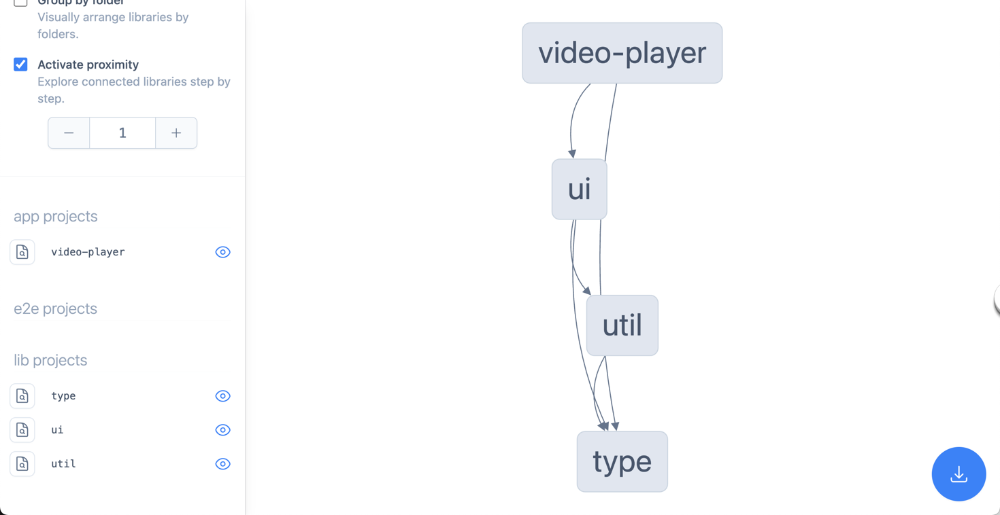
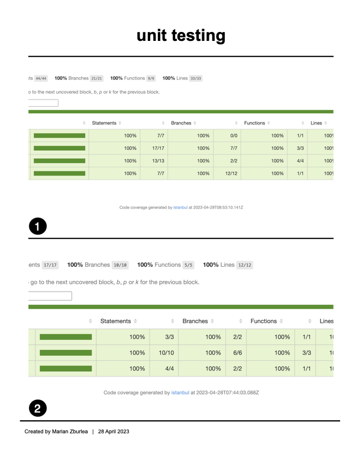

# Wow Video Player Test

## Table of Contents

1. [What value would I add to the project if I would spend more time ↩](#what-value-would-i-add-to-the-project-if-i-would-spend-more-time)
   - [Improve the Video Player when Loading Multiple Videos of the Same Type ↩](#improve-the-video-player-when-loading-multiple-videos-of-the-same-type)
   - [Finish Volume Control ↩](#finish-volume-control)
   - [Implement Multiple Theme Color Choices ↩](#implement-multiple-theme-color-choices)
   - [Implement Dark and Light Modes ↩](#implement-dark-and-light-modes)
   - [Implement Fluid Typography ↩](#implement-fluid-typography)
   - [Enhance Responsive Web Design ↩](#enhance-responsive-web-design)
1. [Run locally ↩](#run-locally)
1. [Benefits of using Styled-Components in React Applications ↩](#benefits-of-using-styled-components-in-react-applications)
1. [Project Setup ↩](#project-setup)
1. [Benefits of Reusable React Components with Buildable and Publishable UI and Util Libraries, in Monorepos or Separate Projects ↩](#benefits-of-reusable-react-components-with-buildable-and-publishable-ui-and-util-libraries-in-monorepos-or-separate-projects)
1. [Benefits of using Custom Font Icons in your projects ↩](#benefits-of-using-custom-font-icons-in-your-projects)

## What value would I add to the project if I would spend more time

### Improve the Video Player when Loading Multiple Videos of the Same Type

By enhancing the video player to handle multiple videos of the same type efficiently, users would experience smoother video playback and seamless transitions between videos. This improvement would lead to increased user satisfaction and engagement, which in turn could drive higher traffic and user retention for the company.

### Finish Volume Control

Implementing a comprehensive volume control feature would give users more control over their viewing experience, allowing them to easily adjust the audio levels to their preference. This added convenience can lead to a more enjoyable user experience, which can result in increased user satisfaction and positive word-of-mouth for the company.

### Implement Multiple Theme Color Choices

By offering multiple theme color choices, users can personalize the look and feel of the application, creating a more tailored and enjoyable experience. This level of customization can lead to higher user satisfaction, and in turn, increased user loyalty and brand recognition for the company.

### Implement Dark and Light Modes

Adding both dark and light mode options would cater to user preferences and improve the overall user experience, especially during different times of the day or in various lighting conditions. This feature can lead to increased user engagement and satisfaction, ultimately resulting in a larger and more loyal user base for the company.

### Implement Fluid Typography

Integrating fluid typography into the project would ensure that text scales smoothly across different screen sizes and resolutions, providing a consistent and easy-to-read experience for users. This enhancement would lead to improved usability and accessibility, which can contribute to increased user satisfaction and a positive reputation for the company.

### Enhance Responsive Web Design

By further refining the responsive web design, the application would provide a seamless and consistent user experience across various devices and screen sizes. This improvement would increase user satisfaction and make the application more accessible to a wider audience, ultimately benefiting the company through higher user engagement and a broader user base.

## Run locally

In your console type `nx serve video-player` and press <kbd>Enter</kbd>

[⇧ Back to Table of Contents ⇧](#table-of-contents)

## Benefits of using Styled-Components in React Applications

1. **CSS-in-JS**: Styled-components allow you to write CSS directly within your JavaScript code, streamlining your development process and making it easier to manage styles and components together.

2. **Dynamic styling**: Styled-components enable you to use JavaScript variables and logic to create dynamic styles, making it easy to adjust your components based on user input, application state, or other factors.

3. **Scoped styles**: With styled-components, styles are automatically scoped to the specific component they are applied to, reducing the risk of style conflicts and making your codebase more maintainable.

4. **Theming support**: Styled-components provide built-in support for theming, allowing you to easily switch between different color schemes or designs across your entire application.

5. **Enhanced developer experience**: Styled-components offer a seamless developer experience with features like syntax highlighting, auto-completion, and linting support in popular code editors.

6. **Automatic vendor prefixing**: Styled-components automatically apply vendor prefixes to your CSS, ensuring cross-browser compatibility without manual intervention.

7. **Easy integration**: Styled-components can be easily integrated into your existing React applications, and they work well with other popular libraries like React Router and Redux.

8. **Server-side rendering**: Styled-components support server-side rendering out of the box, improving your application's performance and SEO.

9. **Tagged template literals**: Styled-components leverage tagged template literals, making it easy to read and write CSS within your JavaScript code while maintaining syntax consistency.

10. **Active community**: Styled-components have an active community of developers and maintainers, ensuring ongoing improvements, bug fixes, and new features.

To get started with styled-components in your React application, visit the official documentation: https://styled-components.com/

[⇧ Back to Table of Contents ⇧](#table-of-contents)

## Project Setup

Benefits of using Nx for building apps with React, Vue, Angular, Express, VanillaJS and more

1. **Monorepo setup**: Nx enables you to manage multiple projects in a single repository, making it easy to share code and resources among your different apps and libraries.

2. **Consistent structure**: Nx enforces a consistent structure across all your projects, making it easy for developers to switch between projects and understand the overall structure.

3. **Advanced code generation**: Nx provides powerful code generation tools that help you scaffold new applications, libraries, components, and more, saving you time and effort.

4. **Built-in best practices**: Nx comes with built-in best practices, such as a linter, formatter, and test runner, ensuring that your code stays clean and maintainable.

5. **Extensible plugin system**: Nx has a rich plugin ecosystem, allowing you to easily add support for new technologies, such as React, Vue, Angular, Express, VanillaJS, and more.

6. **Effective caching**: Nx utilizes advanced caching mechanisms to reduce build and test times, making your development process more efficient.

7. **CI/CD Integration**: Nx easily integrates with popular CI/CD platforms, ensuring a smooth deployment process.

8. **Incremental builds**: Nx supports incremental builds, allowing you to rebuild only the affected projects, saving time during development and in your CI/CD pipelines.

9. **Dependency graph**: Nx generates a dependency graph for your projects, making it easier to understand the relationship between different components and libraries.

10. **Cross-platform support**: Nx helps you build applications for web, mobile, and desktop using a unified development process, making it easier to share code and resources across platforms.

To learn more about Nx and how to get started, visit the official documentation: https://nx.dev/

[⇧ Back to Table of Contents ⇧](#table-of-contents)

## Benefits of Reusable React Components with Buildable and Publishable UI and Util Libraries, in Monorepos or Separate Projects

1. **Consistent UI**: Reusable components ensure a consistent user interface across your applications, improving user experience and overall design cohesion.

2. **Code reusability**: Sharing UI and util libraries promotes code reusability, reducing the need for duplication and making your codebase more maintainable.

3. **Faster development**: Reusable components speed up development, as developers can quickly build new features or applications using existing components, rather than creating them from scratch.

4. **Easier updates**: Updating or fixing a bug in a shared component automatically propagates the changes to all projects using it, making it easier to maintain and update your codebase.

5. **Improved collaboration**: Shared libraries encourage collaboration among team members, as developers can contribute to and improve a shared set of components.

6. **Customization**: Reusable components can be built with customization options, allowing you to tailor them to the specific needs of each project while still benefiting from shared code.

7. **Better testing**: Reusable components are easier to test, as you can focus on testing individual components in isolation and be confident in their reliability when used in different projects.

8. **Scalability**: As your projects grow, reusable components can help you scale more effectively by reducing code complexity and making it easier to manage your codebase.

9. **Modularity**: Reusable components promote a modular architecture, allowing you to break down complex applications into smaller, more manageable pieces.

10. **Flexible project structure**: You can choose to house your reusable components in a monorepo or separate projects, depending on your team's preferences and project requirements.

[⇧ Back to Table of Contents ⇧](#table-of-contents)

## Benefits of using Custom Font Icons in your projects

1. **Vector-based**: Custom font icons are vector-based, meaning they scale smoothly to any size without loss of quality or pixelation, ensuring crisp and clear icons on all devices and screen resolutions.

2. **Optimized file size**: Custom font icons are typically smaller in file size compared to image-based icons (such as PNG or SVG), resulting in faster load times and better overall performance.

3. **Easy customization**: Custom font icons can be easily styled with CSS, allowing you to change their size, color, drop shadow, or any other property with just a few lines of code.

4. **Consistent design**: By using a custom font icon set, you can ensure a consistent look and feel across your entire project, making it more visually appealing and professional.

5. **Accessibility**: Custom font icons can be used with proper ARIA attributes, making them accessible for screen readers and ensuring that your website or app is usable by a wider audience.

6. **Browser compatibility**: Custom font icons are supported by all modern browsers, making them a reliable choice for cross-browser compatibility.

7. **Icon font libraries**: There are many popular icon font libraries available, such as Font Awesome, Material Icons, and Ionicons, that provide a wide range of pre-designed icons for you to choose from.

8. **Easily extendable**: You can create your own custom font icon set using tools like IcoMoon or Fontello, giving you complete control over the design and style of your icons.

9. **Reduced HTTP requests**: By using a custom font icon set, you can reduce the number of HTTP requests made by your website or app, improving load times and overall performance.

10. **CSS effects**: Custom font icons can take advantage of CSS effects such as animations, transitions, and transformations, allowing you to create dynamic and interactive user experiences.

[⇧ Back to Table of Contents ⇧](#table-of-contents)
